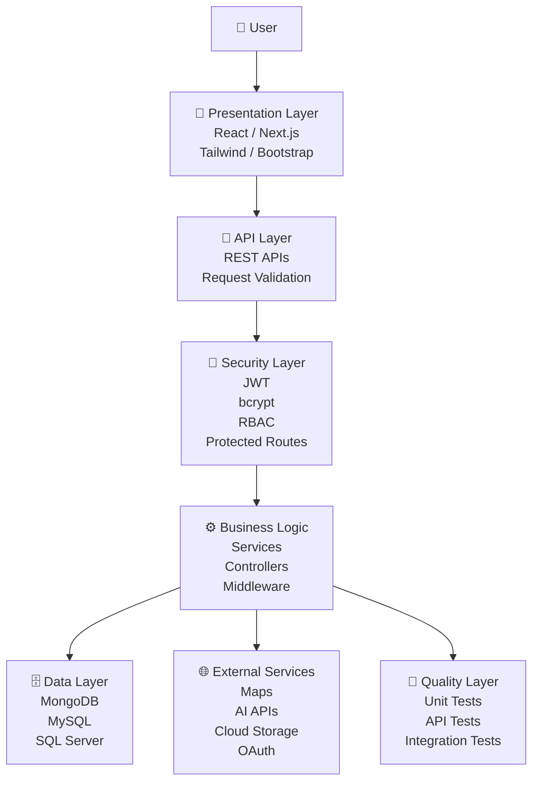
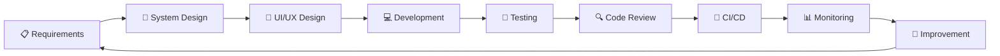
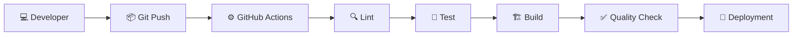
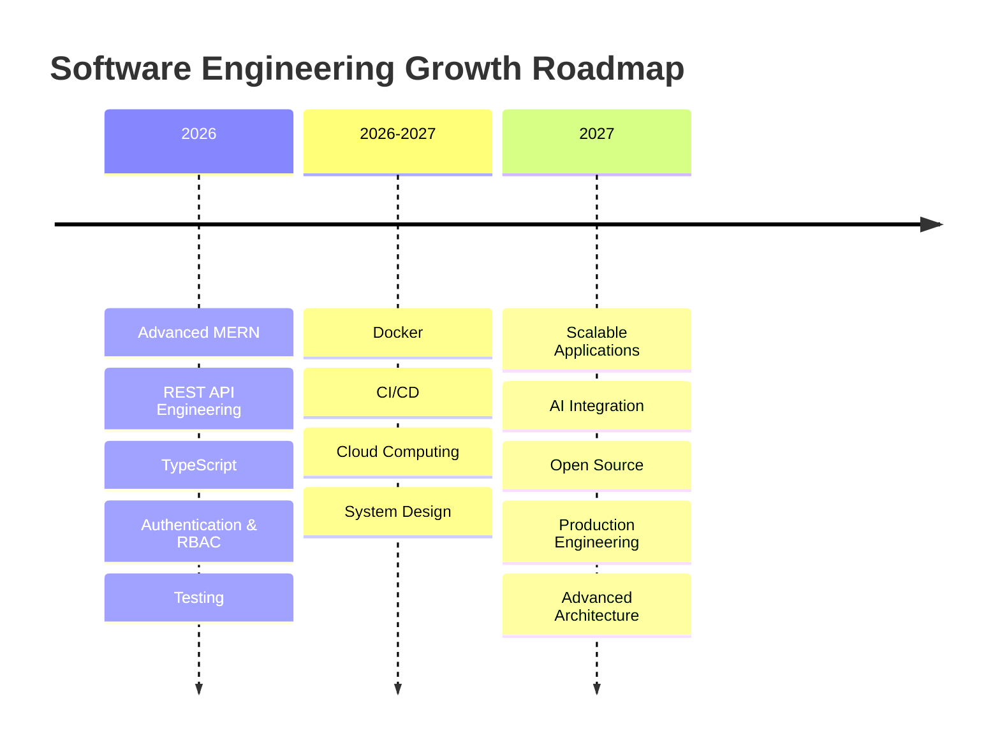

<div align="center">

# 👋 RAVEENDRAN JATHUGULAN

### 🚀 Full Stack Developer · MERN Stack · Software Engineering Student


<a href="https://github.com/Jathugulan">

</a>

<br/>

<a href="https://github.com/Jathugulan">

</a>
<a href="https://www.linkedin.com/in/raveendran-jathugulan/">

</a>
<a href="mailto:jathugulan2022@gmail.com">

</a>

<br/><br/>


</div>

---

# 💫 About Me

```javascript
const developer = {
    name: "Raveendran Jathugulan",
    role: "Full Stack Developer",
    specialization: "MERN Stack",

    education: {
        degree: "Bachelor of Information and Communication Technology (Hons)",
        university: "University of Vavuniya",
        faculty: "Faculty of Technological Studies",
        period: "2023 - Present"
    },

    location: "Jaffna, Sri Lanka",

    frontend: [
        "React.js",
        "Next.js",
        "JavaScript",
        "TypeScript",
        "HTML5",
        "CSS3",
        "Tailwind CSS",
        "Bootstrap",
        "Redux Toolkit",
        "Context API"
    ],

    backend: [
        "Node.js",
        "Express.js",
        "PHP",
        "Laravel",
        "Django",
        ".NET"
    ],

    databases: [
        "MongoDB",
        "MongoDB Atlas",
        "MySQL",
        "SQL Server"
    ],

    engineering: [
        "REST API Design",
        "JWT Authentication",
        "RBAC",
        "OOP",
        "Data Structures",
        "Unit Testing",
        "API Integration",
        "Agile / Scrum"
    ],

    interests: [
        "System Design",
        "Cloud Computing",
        "DevOps",
        "AI Integration",
        "Data Analytics",
        "Software Architecture"
    ],

    philosophy: "Build → Learn → Improve → Ship → Repeat"
};
```

🎓 BICT (Hons.) undergraduate at the **University of Vavuniya**
💻 Full-stack developer focused on **MERN application development**
🔐 Interested in secure authentication, RBAC, API architecture and scalable systems
🎨 Passionate about premium, responsive and accessible UI/UX
📊 Exploring data analytics, AI integration, cloud computing and DevOps
🚀 Building real-world applications that solve practical problems

---

# 🧭 Engineering Mindset

I don't focus only on making an application "work".

I focus on building applications that are:

| Engineering Principle | Focus                                                      |
| --------------------- | ---------------------------------------------------------- |
| 🏗️ Architecture      | Modular and maintainable application structure             |
| 🔐 Security           | Authentication, authorization and secure API design        |
| ⚡ Performance         | Efficient queries, optimized rendering and API performance |
| 📱 UX                 | Responsive, accessible and intuitive interfaces            |
| 🧪 Quality            | Testing, validation and error handling                     |
| 📊 Observability      | Logs, analytics, health checks and monitoring              |
| 🔄 Maintainability    | Clean code, reusable components and documentation          |
| 🚀 Scalability        | Architecture designed for future growth                    |

---

# 🧠 My Development Architecture



---

# 🔄 Software Development Lifecycle



---

# 🛠️ Technology Arsenal

## 🎨 Frontend Engineering

<p align="center">

</p>

**Core:** HTML5 · CSS3 · JavaScript ES6+ · TypeScript
**Frameworks:** React.js · Next.js
**UI:** Tailwind CSS · Bootstrap · Responsive Design
**State:** Redux Toolkit · Context API

---

## ⚙️ Backend Engineering

<p align="center">

</p>

**Runtime:** Node.js
**Frameworks:** Express.js · Laravel · Django · .NET
**Architecture:** REST APIs · MVC · Service Layer · Middleware
**Security:** JWT · bcrypt · RBAC · Validation

---

## 🗄️ Database Engineering

<p align="center">

</p>

MongoDB · MongoDB Atlas · MySQL · SQL Server
Database Design · CRUD · Indexing · Relationships · Aggregation

---

## 💻 Programming Languages

<p align="center">

</p>

`JavaScript` · `TypeScript` · `Java` · `Python` · `C++` · `C#` · `PHP` · `SQL`

---

## 🔐 Security & API Engineering

<p align="center">


</p>

* JWT-based authentication
* Password hashing
* Role-Based Access Control
* Protected API routes
* Input validation
* Secure environment variables
* CORS configuration
* API error handling
* Authentication middleware
* Authorization middleware

---

# 🧰 Developer Tools

<p align="center">

</p>

`Git` · `GitHub` · `VS Code` · `Postman` · `Figma` · `Docker` · `XAMPP` · `Visual Studio`

---

# ☁️ Cloud & DevOps

<p align="center">

</p>

Currently developing skills in:

* 🐳 Docker
* ⚙️ GitHub Actions
* ☁️ Cloud architecture
* 🔄 CI/CD pipelines
* 📊 Application monitoring
* 🔐 Environment configuration
* 🚀 Deployment automation

---

# 🚀 Featured Projects

## 🩸 LifeLink — Blood Donation Emergency Matcher

**Repository:** [blood-donation-emergency-matcher](https://github.com/Jathugulan/blood-donation-emergency-matcher)

> Emergency blood-request and donor-matching platform designed to reduce critical transfusion delays by connecting compatible nearby donors with urgent requests.

### ✨ Key Features

* 🩸 Blood-group compatibility matching
* 📍 Location-based donor discovery
* 🚨 Emergency blood requests
* 🔔 Real-time notifications
* 🏥 Hospital and requester management
* 👤 Donor profiles
* 📊 Analytics dashboards
* 🗺️ Interactive maps
* 🔐 JWT authentication
* 🛡️ Role-Based Access Control
* ⚡ Socket.IO real-time communication

### 🧱 Tech Stack

`MongoDB` · `Express.js` · `React.js` · `Node.js` · `TypeScript` · `Tailwind CSS` · `JWT` · `Socket.IO` · `Leaflet` · `OpenStreetMap` · `Recharts`

---

## 📚 Tholan Book Shop

**Repository:** [tholan-book-shop](https://github.com/Jathugulan/tholan-book-shop)

> AI-enhanced MERN bookstore designed to modernize bookstore management through digital discovery, ordering, inventory management, customer management and location-based delivery calculation.

### ✨ Key Features

* 📚 Digital book discovery
* 🔎 Advanced search
* 🤖 AI-powered recommendations
* 🛒 Online ordering
* 📦 Inventory management
* 👥 Customer management
* 📍 Location-based delivery calculation
* 🗺️ Interactive maps
* 📊 Admin analytics
* 🔐 Secure authentication
* 📱 Responsive premium UI
* 🎞️ Framer Motion interactions

### 🧱 Tech Stack

`MongoDB` · `Express.js` · `React.js` · `Node.js` · `Vite` · `Redux Toolkit` · `Tailwind CSS` · `JWT` · `Mongoose` · `Leaflet` · `OpenStreetMap` · `REST APIs` · `Chart.js` · `Framer Motion`

---

## 🚗 QuickRide — Vehicle Rental & Booking System

**Repository:** [quickride-vehicle-rental-booking](https://github.com/Jathugulan/quickride-vehicle-rental-booking)

> Full-stack vehicle rental platform that centralizes vehicle discovery, availability tracking, customer management and online reservations.

### ✨ Key Features

* 🚘 Vehicle discovery
* 📅 Availability tracking
* 🔎 Vehicle search
* 🛒 Online reservations
* 🔐 Secure authentication
* 👥 Role-based access
* ⚠️ Availability validation
* 🚫 Double-booking prevention
* 📊 Booking management
* 👤 Customer management
* 🔄 REST API integration

### 🧱 Tech Stack

`React.js` · `JavaScript` · `Node.js` · `Express.js` · `MongoDB` · `Mongoose` · `JWT` · `bcrypt` · `REST API`

---

## 🍽️ Vada Marutham Restaurant

**Repository:** [vadamarutham-restaurant](https://github.com/Jathugulan/vadamarutham-restaurant)

> Digital restaurant management platform focused on food ordering, table reservations and centralized restaurant operations.

### ✨ Key Features

* 🍛 Digital food ordering
* 🪑 Table reservations
* 👥 Customer management
* 📋 Order management
* 📊 Centralized operations
* 🔐 Authentication
* 🗺️ Location functionality
* 📱 Responsive interface

### 🧱 Tech Stack

`MongoDB` · `Express.js` · `React.js` · `Node.js` · `Tailwind CSS` · `JWT` · `Mongoose` · `Leaflet` · `REST APIs`

---

## 👨‍🏫 TeacherPayRollERP

**Repository:** [TeacherPayRollERP](https://github.com/Jathugulan/TeacherPayRollERP)

> Full-stack ERP system for managing teacher records, attendance, leave workflows, payroll calculations and administrative reporting.

### ✨ Key Features

* 👨‍🏫 Teacher management
* 🕐 Attendance management
* 🏖️ Leave management
* 💰 Payroll processing
* 🧾 Salary slips
* 📊 Administrative reporting
* 🔐 JWT authentication
* 🔑 Google OAuth
* 🛡️ Role-based access

### 🧱 Tech Stack

`React 19` · `Vite` · `Node.js` · `Express.js` · `MongoDB Atlas` · `Mongoose` · `Tailwind CSS` · `JWT` · `Google OAuth` · `REST API`

---

## 🎓 Alumni Management System

**Repository:** [Alumni-Management-system](https://github.com/Jathugulan/Alumni-Management-system)

> University alumni management platform that centralizes alumni profiles and communication while improving university–alumni engagement.

### 🧱 Tech Stack

`JavaScript` · `PHP` · `MySQL` · `HTML5` · `CSS3` · `Bootstrap` · `REST API` · `XAMPP`

---

## 💊 PharmaNova

**Repository:** [PharmaNova](https://github.com/Jathugulan/PharmaNova)

> Desktop pharmacy management system designed to automate medicine inventory, billing, stock tracking and sales reporting.

### 🧱 Tech Stack

`C#` · `.NET Framework` · `Windows Forms` · `SQL Server` · `ADO.NET` · `Visual Studio`

---

# 📊 Project Engineering Matrix

| Project                 | Domain         | Architecture | Database   | Key Engineering        |
| ----------------------- | -------------- | ------------ | ---------- | ---------------------- |
| 🩸 LifeLink             | Healthcare     | MERN         | MongoDB    | Real-time + Geo        |
| 📚 Tholan Book Shop     | E-Commerce     | MERN         | MongoDB    | AI + Maps              |
| 🚗 QuickRide            | Vehicle Rental | MERN         | MongoDB    | Booking + Auth         |
| 🍽️ Vada Marutham       | Restaurant     | MERN         | MongoDB    | Ordering + Reservation |
| 👨‍🏫 TeacherPayRollERP | ERP            | MERN         | MongoDB    | Payroll + RBAC         |
| 🎓 Alumni System        | Education      | PHP          | MySQL      | CRUD + REST            |
| 💊 PharmaNova           | Pharmacy       | .NET         | SQL Server | Desktop ERP            |

---

# 💼 Professional Experience

## Full Stack Web Development Intern

### Pantech.AI · 3-Month Internship

**Issued:** June 2026

* Built practical full-stack development experience
* Worked with frontend and backend technologies
* Developed REST API integrations
* Worked with database-driven applications
* Applied real-world software development practices

---

## Full Stack Development Intern

### NoviTech R&D Pvt Ltd · 1-Month Internship

**Issued:** May 2026

* Gained practical experience in full-stack development
* Worked with frontend and backend integration
* Applied software development workflows
* Strengthened understanding of web application architecture

---

# 🎓 Education

## Bachelor of Information and Communication Technology (Hons)

**University of Vavuniya**
Faculty of Technological Studies
**2023 – Present · Sri Lanka**

### Core Academic Areas

`Software Engineering` · `Web Engineering` · `Database Systems` · `OOP` · `Data Structures` · `Computer Networks` · `HCI` · `System Analysis` · `Software Development`

---

# 🏆 Certifications & Professional Learning

| Certification                                    | Provider                                      | Year |
| ------------------------------------------------ | --------------------------------------------- | ---- |
| 🏆 30 Days MasterClass in Full Stack Development | NoviTech R&D Pvt Ltd                          | 2026 |
| 🌐 Web Design for Beginners                      | University of Moratuwa                        | 2026 |
| 🤖 Artificial Intelligence                       | Pantech.AI                                    | 2026 |
| ⚙️ Professional Certificate in DevOps            | Udemy                                         | 2026 |
| 🌐 Introduction to MERN Stack                    | Simplilearn                                   | 2025 |
| 🌐 Introduction to MEAN Stack                    | Simplilearn                                   | 2025 |
| 💻 Tech for Everyone                             | Sololearn                                     | 2025 |
| 🧠 I2OR Young Innovator Mindset                  | International Institute of Organized Research | 2026 |

### Additional Learning

`Data Analytics` · `Data Science` · `Machine Learning` · `Angular` · `JavaScript` · `Python` · `SQL` · `UI/UX Design` · `Frontend Development` · `Web Development` · `Azure IoT`

---

# 📈 Engineering Capability Matrix

| Area            | Focus                                      |
| --------------- | ------------------------------------------ |
| 🎨 Frontend     | React · Next.js · Tailwind · Bootstrap     |
| ⚙️ Backend      | Node.js · Express · PHP · Laravel · Django |
| 🗄️ Databases   | MongoDB · MySQL · SQL Server               |
| 🔐 Security     | JWT · bcrypt · RBAC · OAuth                |
| 🔗 APIs         | REST · API Integration · Validation        |
| 🧪 Testing      | Unit Testing · API Testing                 |
| 🐳 DevOps       | Docker · GitHub Actions · CI/CD            |
| ☁️ Cloud        | Cloud Deployment · Infrastructure Concepts |
| 📐 Architecture | MVC · Modular Architecture · System Design |
| 🤖 AI           | AI Integration · ML Fundamentals           |
| 📊 Analytics    | Data Analytics · Visualization             |

---

# 🧪 Engineering Quality Standards

When developing projects, I aim to implement:

```text
✅ Clean Code
✅ Modular Architecture
✅ Reusable Components
✅ API Validation
✅ Centralized Error Handling
✅ Authentication
✅ Authorization
✅ RBAC
✅ Secure Environment Variables
✅ Database Validation
✅ Responsive UI
✅ Accessibility
✅ API Documentation
✅ Unit Testing
✅ Integration Testing
✅ Git Version Control
✅ Code Review
✅ CI/CD Automation
```

---

# 🔐 Application Security

```mermaid
flowchart LR

    Request["🌐 Client Request"]
    Rate["🛡️ Rate Limiting"]
    CORS["🔒 CORS"]
    Validate["✅ Input Validation"]
    Auth["🔑 Authentication"]
    RBAC["👮 Authorization / RBAC"]
    Service["⚙️ Business Logic"]
    DB["🗄️ Database"]

    Request --> Rate
    Rate --> CORS
    CORS --> Validate
    Validate --> Auth
    Auth --> RBAC
    RBAC --> Service
    Service --> DB
```



### Security Practices

* 🔑 JWT authentication
* 🔐 Password hashing
* 👮 Role-Based Access Control
* 🛡️ Protected routes
* 🧹 Input validation
* 🌐 CORS protection
* 🔒 Environment variables
* 🚫 Unauthorized request prevention
* 🗄️ Database validation
* ⚠️ Centralized error handling

---

# 🧪 Testing Strategy

My target engineering workflow includes:

```text
Unit Tests
    ↓
API Tests
    ↓
Integration Tests
    ↓
Authentication Tests
    ↓
Authorization Tests
    ↓
Edge Case Testing
    ↓
Regression Testing
    ↓
CI Validation
```

### Testing Tools

`Jest` · `Supertest` · `Postman` · API Test Collections

---

# ⚙️ CI/CD & Automation



### Automation Goals

* 🔄 Automated builds
* 🧪 Automated tests
* 🔍 Code quality checks
* 📦 Dependency validation
* 🚀 Deployment pipelines
* 🔐 Secret-safe configuration
* 📊 Build status tracking

---

# 📊 GitHub Analytics

<div align="center">


</div>

---

# 🔥 GitHub Streak

<div align="center">


</div>

---

# 🏆 GitHub Trophies

<div align="center">


</div>

---

# 📈 Contribution Activity

<div align="center">


</div>

---

# 🐍 Contribution Snake

<div align="center">


</div>

---

# 📦 Repository Intelligence

> This profile can be enhanced with GitHub Actions to automatically maintain repository statistics and portfolio information.

### 🤖 Automation Features

```text
📊 Repository Statistics
⭐ Stars Tracking
🍴 Fork Tracking
👥 Followers
📝 Commit Activity
🔀 Pull Requests
🐛 Issues
📅 Recent Repositories
💻 Language Detection
🏷️ Repository Topics
🔥 Repository Activity
📈 Contribution Metrics
🚀 Deployment Status
📝 README Health
```

---

# 🧠 Advanced Profile Automation

The profile can use GitHub Actions to automatically update:

```text
┌─────────────────────────────────────────┐
│        PROFILE AUTOMATION ENGINE        │
├─────────────────────────────────────────┤
│                                         │
│  🔍 Repository Discovery                │
│  📊 GitHub Statistics                   │
│  ⭐ Stars & Forks                       │
│  🔥 Recent Activity                    │
│  💻 Language Detection                  │
│  🏷️ Repository Topics                   │
│  📝 README Quality                      │
│  📈 Contribution Metrics                │
│  🚀 Deployment Detection                │
│  🧪 CI/CD Status                        │
│  📦 Project Portfolio                   │
│  🔄 Automatic README Updates            │
│                                         │
└─────────────────────────────────────────┘
```

---

# 🗂️ Project Portfolio Categories

```text
FULL STACK WEB APPLICATIONS
████████████████████░░  90%

MERN APPLICATIONS
██████████████████░░░░  85%

REST API DEVELOPMENT
█████████████████░░░░░  80%

DATABASE ENGINEERING
███████████████░░░░░░░  75%

UI / UX ENGINEERING
███████████████░░░░░░░  75%

AUTHENTICATION & RBAC
██████████████░░░░░░░░  70%

AI INTEGRATION
██████████░░░░░░░░░░░░  50%

DEVOPS & CLOUD
██████████░░░░░░░░░░░░  50%

SYSTEM DESIGN
██████████░░░░░░░░░░░░  50%
```

> These are personal development indicators rather than formal certification scores.

---

# 🌱 Currently Learning

<div align="center">


</div>

### Current Focus

* 🧩 Advanced MERN architecture
* 🏗️ Scalable backend architecture
* 🔐 Advanced authentication and authorization
* 🐳 Docker and containerization
* ⚙️ CI/CD pipelines
* ☁️ Cloud engineering
* 📐 System design
* 🤖 AI-powered applications
* 📊 Data analytics
* 🧪 Automated testing

---

# 🎯 2026–2027 Strategic Goals



### 🎯 Targets

* [x] Build full-stack applications
* [x] Build REST APIs
* [x] Work with MongoDB
* [x] Work with MySQL
* [x] Implement JWT authentication
* [x] Implement RBAC
* [x] Complete full-stack internships
* [ ] Master TypeScript
* [ ] Build production-grade SaaS applications
* [ ] Improve system design
* [ ] Build CI/CD pipelines
* [ ] Improve cloud engineering
* [ ] Build AI-integrated applications
* [ ] Contribute to open-source projects
* [ ] Build scalable distributed systems

---

# 🌍 Open Source & Collaboration

I'm interested in collaborating on:

* 🚀 MERN applications
* 🌐 Full-stack web applications
* 🔗 REST API projects
* 🤖 AI-integrated applications
* 📊 Data-driven platforms
* 🧰 Developer tools
* 🎓 University projects
* 🌍 Open-source projects
* 💡 Innovative technology solutions

---

# 🗣️ Languages

| Language     | Proficiency                      |
| ------------ | -------------------------------- |
| 🇱🇰 Tamil   | Professional Working Proficiency |
| 🇬🇧 English | Working Proficiency              |
| 🇱🇰 Sinhala | Working Proficiency              |

---

# 💭 Developer Philosophy

> ### **Build → Learn → Improve → Ship → Repeat**

I believe software engineering is a continuous process of learning, building, testing, failing, improving and shipping.

Every project is an opportunity to understand a problem better, design a better solution and become a better engineer.

---

# 📬 Connect With Me

<div align="center">

### Let's build something meaningful together. 🚀

<br/>

<a href="https://github.com/Jathugulan">

</a>

<a href="https://www.linkedin.com/in/raveendran-jathugulan/">

</a>

<a href="mailto:jathugulan2022@gmail.com">

</a>

</div>

---

# 📊 Profile Snapshot

<div align="center">

| 👨‍💻 Role           | 🚀 Focus   | 🎓 Education | 🌍 Location |
| -------------------- | ---------- | ------------ | ----------- |
| Full Stack Developer | MERN Stack | BICT (Hons.) | Sri Lanka   |

</div>

---

# ⭐ Featured Technology

<div align="center">


</div>

---

# 👀 Profile Visitors

<div align="center">


</div>

---

<div align="center">


### ⭐ Thanks for visiting my GitHub profile!

**Always learning · Always building · Always improving · Always shipping 🚀**

<br/>

<sub>© Raveendran Jathugulan · Full Stack Developer</sub>

</div>
