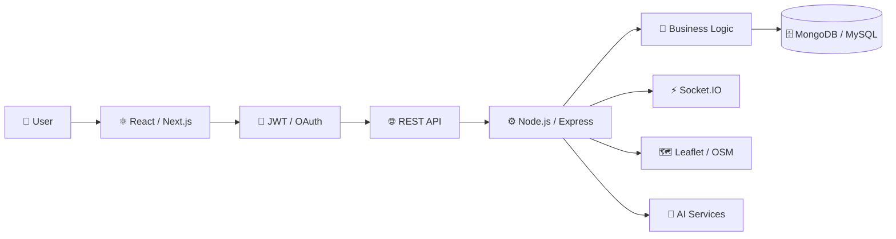
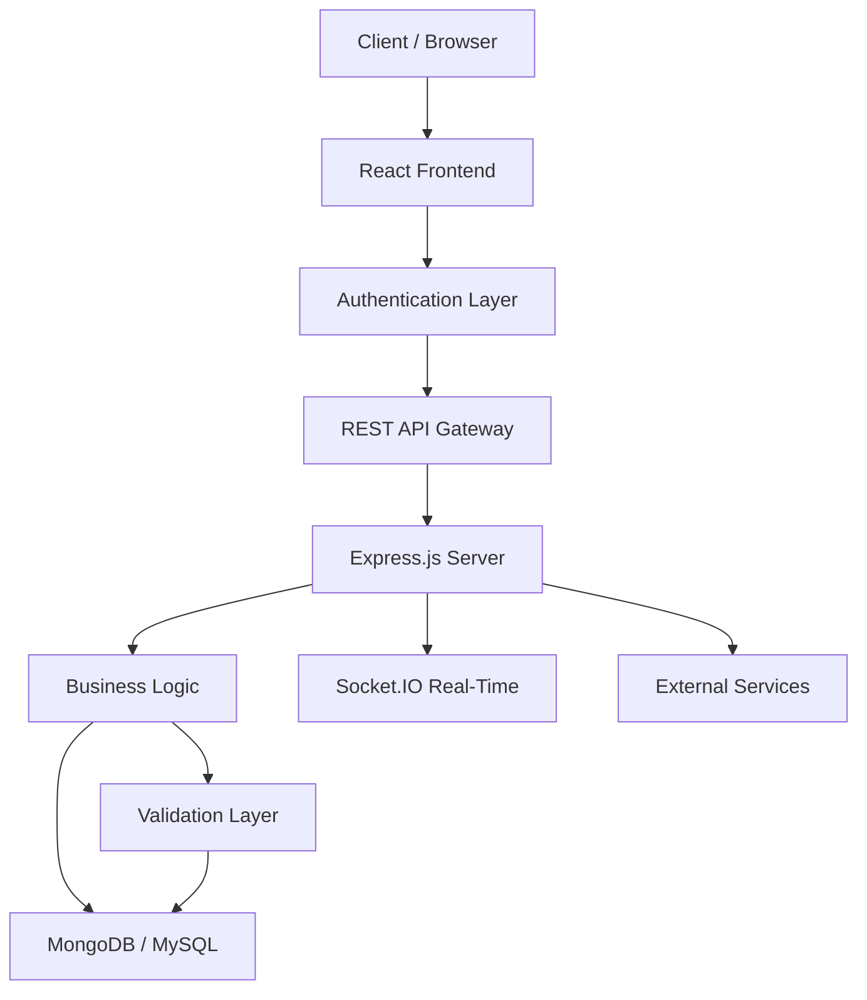
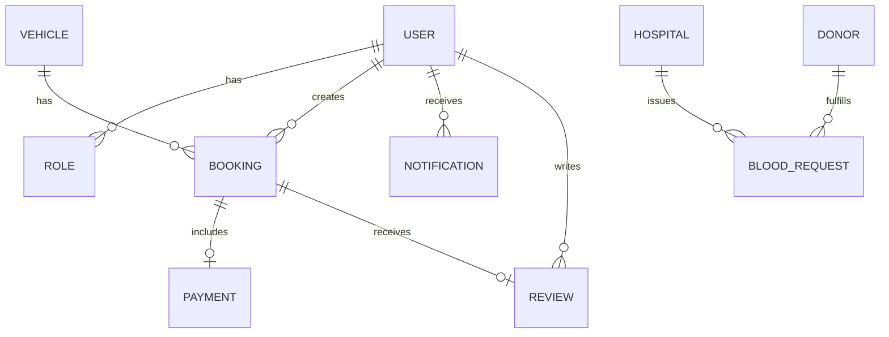

<div align="center">

<!-- ========================================================= -->
<!-- PREMIUM HERO HEADER                                        -->
<!-- ========================================================= -->


<br/>

### Full Stack Developer · MERN Stack · BICT (Hons.) · Sri Lanka

Building practical, secure and scalable web applications across frontend, backend and database layers.

<p>
<a href="https://github.com/Jathugulan"></a>
<a href="https://www.linkedin.com/in/raveendran-jathugulan/"></a>
<a href="https://portfolio-pi-sepia-30.vercel.app/"></a>
<a href="mailto:jathugulan2022@gmail.com"></a>
</p>

<p>


</p>

</div>

---

## 🧭 Quick Navigation

[About](#-about-me) · [Dashboard](#-recruiter-dashboard) · [Skills](#-technology-stack) · [Projects](#-featured-projects) · [Architecture](#-engineering-architecture) · [Security](#-security--api-engineering) · [Analytics](#-github-analytics) · [Experience](#-experience) · [Certifications](#-certifications) · [Roadmap](#-learning-roadmap) · [Contact](#-lets-connect)

---

## 👨‍💻 About Me

I'm **Raveendran Jathugulan**, a Full Stack Developer and Bachelor of Information and Communication Technology (Hons.) undergraduate at the **University of Vavuniya**, Faculty of Technological Studies.

I enjoy transforming real-world problems into practical software solutions. My work spans React, Next.js, Node.js, Express.js, MongoDB, MySQL, REST APIs, authentication, RBAC, maps, real-time features and analytics.

### 🎯 Engineering Focus

- ⚛️ Responsive and component-driven frontend development
- ⚙️ RESTful backend and API development
- 🗄️ Database design, CRUD operations and data modeling
- 🔐 JWT, OAuth, bcrypt and role-based access control
- 🏗️ Application architecture and clean engineering practices
- 🧪 Debugging, unit testing and API integration
- 🤖 AI-enabled application features

---

## 📊 Recruiter Dashboard

```text
┌────────────────────┬────────────────────┬────────────────────┬────────────────────┐
│   FULL STACK       │   MERN STACK       │   API              │   DATABASE         │
│   DEVELOPER        │   DEVELOPMENT      │   ENGINEERING      │   ENGINEERING      │
├────────────────────┼────────────────────┼────────────────────┼────────────────────┤
│ React · Next.js    │ Node.js · Express  │ REST · JWT · RBAC  │ MongoDB · MySQL    │
│ TypeScript · Vite  │ MongoDB · Mongoose │ OAuth · Validation │ SQL Server         │
└────────────────────┴────────────────────┴────────────────────┴────────────────────┘
```

| Area | Details |
|------|---------|
| **Role** | Full Stack Developer |
| **Primary Stack** | MERN (MongoDB, Express.js, React.js, Node.js) |
| **Degree** | BICT (Hons.) — University of Vavuniya |
| **Location** | Point Pedro, Jaffna, Sri Lanka |
| **Current Focus** | Full Stack & Software Engineering |
| **Open To** | Software Engineering Internships · Full Stack Opportunities |

---

## 🛠️ Technology Stack

### 💻 Programming Languages

<p align="center">

</p>

`JavaScript (ES6+)` · `TypeScript` · `Java` · `Python` · `C++` · `C#` · `PHP` · `SQL`

### 🎨 Frontend Development

<p align="center">

</p>

`React.js` · `Next.js` · `HTML5` · `CSS3` · `Tailwind CSS` · `Bootstrap` · `Redux Toolkit` · `Context API` · `Vite` · `Responsive Design`

### ⚙️ Backend Development

<p align="center">

</p>

`Node.js` · `Express.js` · `Django` · `Laravel` · `PHP` · `.NET Framework` · `REST APIs` · `MVC`

### 🗄️ Databases

<p align="center">

</p>

`MongoDB` · `MongoDB Atlas` · `MySQL` · `SQL Server` · `Mongoose` · `Database Design` · `CRUD Operations`

### 🔐 Security & APIs

`JWT` · `bcrypt` · `OAuth 2.0` · `RBAC` · `CORS` · `Input Validation` · `Protected Routes` · `Centralized Error Handling`

### 🧰 Tools & Platforms

<p align="center">

</p>

`Git` · `GitHub` · `VS Code` · `Postman` · `Docker` · `Figma` · `Vercel` · `XAMPP` · `Visual Studio`

### 🧩 Core Engineering Skills

`OOP` · `Data Structures` · `Debugging` · `Unit Testing` · `API Integration` · `Agile/Scrum` · `Mongoose` · `AJAX` · `Chart.js` · `Framer Motion`

---

## 🚀 Featured Projects

### ⭐ Tier 1 — Featured Projects

<table>
<tr>
<td width="50%" valign="top">

#### 🩸 LifeLink — Blood Donation Emergency Matcher

Emergency blood-request and donor matching platform.

**Problem:** Critical transfusion delays due to manual donor search.

**Solution:** Real-time blood matching with location-based discovery.

**Core Features:**
- 🩸 Blood-group compatibility matching
- 🚨 Emergency request system
- 📍 Location-based donor discovery (Leaflet + OpenStreetMap)
- 🔔 Real-time notifications (Socket.IO)
- 🏥 Hospital management
- 👤 Donor profiles & analytics (Recharts)
- 🗺️ Interactive maps
- 🔐 JWT authentication & RBAC

**Stack:** `React` · `TypeScript` · `Node.js` · `Express` · `MongoDB` · `Socket.IO` · `JWT` · `Leaflet`

**Status:** ✅ Completed · 2026

🔗 [View Repository](https://github.com/Jathugulan/blood-donation-emergency-matcher)

</td>
<td width="50%" valign="top">

#### 🚗 QuickRide — Vehicle Rental & Booking

Full-stack vehicle rental and booking management platform.

**Problem:** Fragmented vehicle rental management.

**Solution:** Centralized booking engine with availability tracking.

**Core Features:**
- 🚘 Vehicle discovery & search
- 📅 Availability management
- 🛒 Rental booking workflow
- 🚫 Double-booking prevention
- 👥 Customer management
- 🔐 Authentication & RBAC
- 📊 Booking management

**Stack:** `React` · `Node.js` · `Express.js` · `MongoDB` · `Mongoose` · `JWT` · `bcrypt` · `REST API`

**Status:** ✅ Completed · 2026

🔗 [View Repository](https://github.com/Jathugulan/quickride-vehicle-rental-booking)

</td>
</tr>
<tr>
<td width="50%" valign="top">

#### 📚 Tholan Book Shop — Digital Bookstore

Modern MERN bookstore with AI-powered features.

**Problem:** Traditional bookstore limitations.

**Solution:** Digital platform with AI search and analytics.

**Core Features:**
- 📚 Book discovery & advanced search
- 🤖 AI-powered recommendations
- 🛒 Online ordering
- 📦 Inventory management
- 👥 Customer management
- 📍 Location-based delivery (Leaflet)
- 📊 Admin analytics (Chart.js)
- 🎨 Framer Motion animations
- 🔐 Secure authentication

**Stack:** `React` · `Redux Toolkit` · `Vite` · `Node.js` · `Express.js` · `MongoDB` · `Tailwind CSS` · `Chart.js` · `Framer Motion`

**Status:** ✅ Completed · 2026

🔗 [View Repository](https://github.com/Jathugulan/tholan-book-shop)

</td>
<td width="50%" valign="top">

#### 👨‍🏫 TeacherPayRoll ERP — Education & Payroll

Teacher attendance, leave and payroll management system.

**Problem:** Manual payroll and attendance tracking.

**Solution:** Centralized ERP for teacher records and payroll.

**Core Features:**
- 👨‍🏫 Teacher records management
- 📋 Attendance tracking
- 📅 Leave approvals
- 💰 Payroll & salary slips
- 📊 Administrative reporting
- 🔐 Google OAuth & JWT

**Stack:** `React 19` · `Vite` · `Node.js` · `Express.js` · `MongoDB Atlas` · `JWT` · `Google OAuth` · `Tailwind CSS`

**Status:** ✅ Completed · 2026

🔗 [View Repository](https://github.com/Jathugulan/TeacherPayRollERP)

</td>
</tr>
</table>

### ⭐ Tier 2 — Engineering Projects

<table>
<tr>
<td width="50%" valign="top">

#### 🧠 QuizMaster Pro — Learning & Assessment

MERN-based quiz application with structured assessment workflows.

**Stack:** `React` · `Vite` · `Node.js` · `Express` · `MongoDB` · `Mongoose` · `JWT` · `Google OAuth`

🔗 [View Repository](https://github.com/Jathugulan/QuizMaster-Pro)

</td>
<td width="50%" valign="top">

#### 📘 Yarl Skill Hub — Multilingual Learning Platform

Digital learning platform for Sri Lankan learners with multilingual support.

**Stack:** `HTML5` · `CSS3` · `JavaScript` · `Bootstrap` · `PHP` · `MySQL` · `AJAX` · `Chart.js`

🔗 [View Repository](https://github.com/Jathugulan/yarl-skill-hub)

</td>
</tr>
</table>

### ⭐ Tier 3 — Academic & Desktop Projects

<table>
<tr>
<td width="33%" valign="top">

#### 🎓 Alumni Management

University alumni platform.

**Stack:** `PHP` · `MySQL` · `Bootstrap` · `JavaScript`

🔗 [Repository](https://github.com/Jathugulan/Alumni-Management-system)

</td>
<td width="33%" valign="top">

#### 💊 PharmaNova

Desktop pharmacy management.

**Stack:** `C#` · `.NET` · `Windows Forms` · `SQL Server`

🔗 [Repository](https://github.com/Jathugulan/PharmaNova)

</td>
<td width="33%" valign="top">

#### 🍽️ Vadamārutham Restaurant

Restaurant management platform.

**Stack:** `HTML5` · `CSS3` · `JavaScript` · `Bootstrap` · `PHP` · `MySQL`

🔗 [Repository](https://github.com/Jathugulan/vadamarutham-restaurant)

</td>
</tr>
</table>

---

## 📊 Project Technology Matrix

| Project | Domain | Frontend | Backend | Database | Key Features |
|---------|--------|----------|---------|----------|-------------|
| 🩸 LifeLink | Healthcare | React · TypeScript | Node.js · Express | MongoDB | Real-Time · Maps · RBAC |
| 🚗 QuickRide | Vehicle Rental | React | Node.js · Express | MongoDB | Booking · RBAC · Validation |
| 📚 Tholan Book Shop | E-Commerce | React · Redux · Vite | Node.js · Express | MongoDB | AI · Maps · Analytics |
| 👨‍🏫 TeacherPayRoll | ERP | React 19 · Vite | Node.js · Express | MongoDB Atlas | OAuth · Payroll · RBAC |
| 🧠 QuizMaster Pro | Education | React · Vite | Node.js · Express | MongoDB | OAuth · Assessment |
| 📘 Yarl Skill Hub | Education | JavaScript · AJAX | PHP | MySQL | Multilingual · Charts |
| 🎓 Alumni System | Education | JavaScript · Bootstrap | PHP | MySQL | CRUD · REST API |
| 💊 PharmaNova | Pharmacy | Windows Forms | .NET | SQL Server | ADO.NET · Desktop ERP |
| 🍽️ Vadamārutham | Restaurant | HTML · CSS · JS | PHP | MySQL | Ordering · Reservations |

---

## 🏗️ Engineering Architecture

### 🔄 Full Stack Application Flow



### 🔄 Engineering Workflow

```text
Requirements → System Design → UI/UX → Frontend Development →
REST API Development → Business Logic → Database Design →
Authentication & Security → Testing & Debugging → Documentation →
Release / Deployment
```

### 📐 System Architecture Concept



### 🗄️ Database Architecture Concept



> Diagram relationships are architectural representations for profile documentation.

---

## 🔐 Security & API Engineering

### 🔒 Security Architecture

```text
Client Request
      │
      ▼
🛡️ Rate Limiting & CORS
      │
      ▼
✅ Input Validation
      │
      ▼
🔑 JWT Authentication
      │
      ▼
👮 RBAC Authorization
      │
      ▼
⚙️ Business Logic
      │
      ▼
🗄️ Database Access
```

### 🔑 Authentication & Authorization

| Layer | Implementation |
|-------|---------------|
| **Authentication** | JWT · Google OAuth · Session Management |
| **Authorization** | RBAC · Role-Based Routes · Protected Endpoints |
| **Password Security** | bcrypt Hashing · Salt Rounds |
| **API Security** | CORS · Input Validation · Secure Headers |

### 🌐 API Engineering

| Capability | Details |
|------------|---------|
| **Architecture** | RESTful API Design · MVC Pattern |
| **Operations** | CRUD · Pagination · Filtering · Sorting |
| **Validation** | Input Sanitization · Data Validation |
| **Error Handling** | Centralized Error Handler · Structured Responses |
| **Testing** | Postman · API Integration Testing |
| **Documentation** | Structured Endpoint Documentation |

---

## ⚡ Real-Time & Maps Engineering

### 🔔 Real-Time Capabilities

- ⚡ Socket.IO real-time notifications
- 🚨 Emergency alert system
- 📡 Live status updates
- 🔄 Event-driven architecture
- 📊 Real-time data synchronization

### 🗺️ Maps & Location

- 📍 Leaflet integration
- 🗺️ OpenStreetMap tiles
- 📏 Distance calculations
- 🔍 Location-based search
- 📌 Interactive map markers

---

## 🗄️ Database Engineering

```text
DATABASE ENGINEERING

MongoDB
├── Mongoose ODM
├── Schema Design
├── Aggregation Pipeline
├── Indexing
├── Data Modeling
└── MongoDB Atlas (Cloud)

MySQL
├── Relational Design
├── CRUD Operations
├── Complex Queries
└── XAMPP Stack

SQL Server
├── ADO.NET Integration
├── Windows Forms
└── Database Management
```

---

## 🧪 Testing & Quality Engineering

```text
QUALITY ASSURANCE

Unit Testing
├── Component Testing
└── Function Testing

API Testing
├── Postman
└── REST Client

Debugging
├── Browser DevTools
├── Node.js Debugging
└── Error Tracking

Code Quality
├── Clean Code Practices
├── Modular Architecture
├── Code Review
└── Version Control (Git)
```

---

## ⚙️ DevOps & Engineering Workflow

```text
💻 Development Environment (VS Code)
        ↓
📦 Git Version Control
        ↓
🔀 Branch Management
        ↓
🧪 Testing & Debugging
        ↓
📝 Code Review
        ↓
🔀 Pull Request
        ↓
⚙️ GitHub Actions (CI/CD)
        ↓
🐳 Docker Containerization
        ↓
🚀 Deployment (Vercel / Cloud)
        ↓
📊 Monitoring
```

| Tool | Purpose |
|------|---------|
| `Git` | Version Control |
| `GitHub` | Code Hosting & Collaboration |
| `GitHub Actions` | CI/CD Automation |
| `Docker` | Containerization |
| `Postman` | API Testing |
| `Vercel` | Frontend Deployment |

---

## 📈 GitHub Analytics

<div align="center">

<a href="https://github.com/Jathugulan">

</a>
<a href="https://github.com/Jathugulan">

</a>

<br/><br/>


<br/><br/>


</div>

### 🏆 GitHub Trophies

<div align="center">


</div>

### 📊 Technology Coverage

```text
JavaScript      ████████████████████  Primary
TypeScript      ████████████████      Growing
React           ████████████████████  Primary
Node.js         ████████████████████  Primary
MongoDB         ████████████████████  Primary
PHP             ████████████          Secondary
Python          ██████████            Exploring
C# / .NET       ████████              Academic
Java            ███████               Academic
SQL             ██████████████        Strong
```

> Personal development indicators based on project usage — not formal assessment scores.

---

## 🏆 Achievements

<div align="center">

```text
╔═══════════════════════════════════════════════════════╗
║                  ACHIEVEMENT SNAPSHOT                  ║
╠═══════════════════════════════════════════════════════╣
║  🚀  09+  Full-Stack Projects Completed               ║
║  🎓  13+  Professional Certifications                 ║
║  💼  02   Software Internships                        ║
║  ⚙️  30+  Technologies & Tools                        ║
║  🌐  09   Production-Ready Applications               ║
║  📊  Full Stack · MERN · REST APIs · RBAC             ║
╚═══════════════════════════════════════════════════════╝
```

</div>

---

## 💼 Experience

### 📅 Experience Timeline

```text
2026
│
├── 🏢 Pantech.AI
│   Full Stack Web Development Intern
│   Jan 2026 – Apr 2026 · 3 Months
│   ✅ Full-stack web development
│   ✅ Frontend/backend integration
│   ✅ REST API development
│   ✅ Database-driven applications
│
├── 🏢 NoviTech R&D Pvt Ltd
│   Full Stack Development Intern
│   Apr 2026 – May 2026 · 1 Month
│   ✅ Full-stack development workflows
│   ✅ Frontend/backend integration
│   ✅ Modern web development practices
│
└── 🎓 University of Vavuniya
    BICT (Hons.)
    2023 – Present
```

---

## 🎓 Education

**Bachelor of Information and Communication Technology (Hons.)**

**University of Vavuniya** — Faculty of Technological Studies
2023 – Present · Sri Lanka

### Core Areas

`Software Engineering` · `Web Development` · `Database Systems` · `OOP` · `Data Structures` · `Computer Networks` · `HCI` · `System Analysis`

---

## 📜 Certifications

### 🏅 Certification Cards

<table>
<tr>
<td width="50%" valign="top">

#### 🔧 Full Stack & Web Development

| Certification | Provider | Date |
|---|---|---|
| 🏆 MasterClass in Full Stack Development | NoviTech R&D | Jun 2026 |
| 🌐 Introduction to MERN Stack | Simplilearn | Dec 2025 |
| 🌐 Introduction to MEAN Stack | Simplilearn | Dec 2025 |
| 🎨 Web Design for Beginners | University of Moratuwa | Mar 2026 |
| 🌐 Web Development | Coursera | 2025 |

</td>
<td width="50%" valign="top">

#### 🤖 AI & Data

| Certification | Provider | Date |
|---|---|---|
| 🤖 Artificial Intelligence | Pantech.AI | Feb 2026 |
| 🧠 Machine Learning | Pantech.AI | 2026 |
| 📊 Data Analytics | Coursera | 2025 |
| 📊 Data Science & Analytics | Coursera | 2025 |

</td>
</tr>
<tr>
<td width="50%" valign="top">

#### ⚙️ Engineering & DevOps

| Certification | Provider | Date |
|---|---|---|
| ⚙️ Professional Certificate in DevOps | Udemy | Jan 2026 |
| ☕ Java (Basic) | HackerRank | 2025 |
| 💻 Introduction to JavaScript | Sololearn | Nov 2025 |
| 🗄️ Introduction to SQL | Sololearn | 2025 |
| 🐍 Introduction to Python | Saylor Academy | 2025 |

</td>
<td width="50%" valign="top">

#### 🎨 Design & Other

| Certification | Provider | Date |
|---|---|---|
| 💡 I2OR Young Innovator Mindset | I2OR | Jan 2026 |
| 💻 Tech for Everyone | Sololearn | Nov 2025 |
| 🎨 UI/UX Design | Coursera | 2025 |
| 📱 Angular | Coursera | 2025 |

</td>
</tr>
</table>

### 📊 Certification Statistics

```text
CERTIFICATION SNAPSHOT

13+  Total Certifications
 5+  Programming & Development
 4+  AI & Data
 5+  Full Stack & Web
 2+  Engineering & DevOps
```

---

## 🗺️ Learning Roadmap

### 📍 Current Roadmap (2026 — 2027)

<table>
<tr>
<td width="33%" valign="top">

#### ✅ Completed

- Full-stack applications
- React interfaces
- Node.js APIs
- MongoDB systems
- Authentication workflows
- REST API development
- JWT & RBAC implementation
- Real-time features (Socket.IO)

</td>
<td width="33%" valign="top">

#### 🔄 Currently Improving

- TypeScript
- System Design
- API Security
- Testing frameworks
- Performance optimization
- Clean Architecture
- Code quality standards

</td>
<td width="33%" valign="top">

#### 🚀 Next — Exploring

- Docker & CI/CD
- Cloud Engineering
- AI Integration
- Scalable Architecture
- Advanced DevOps
- Open Source Contribution
- Production SaaS Apps

</td>
</tr>
</table>

### 📈 Career Direction

```text
COMPLETED
   ↓
Full Stack MERN Development
   ↓
CURRENTLY MASTERING
   ↓
Advanced TypeScript · System Design · Testing
   ↓
NEXT
   ↓
Docker · CI/CD · Cloud Engineering
   ↓
FUTURE
   ↓
AI Integration · Scalable Systems · Open Source
```

---

## 🌍 Multilingual & Localization

<div align="center">

| 🇱🇰 Tamil | 🇬🇧 English | 🇱🇰 Sinhala |
|---|---|---|
| Professional | Working | Working |
| Proficiency | Proficiency | Proficiency |

</div>

**Focus:** Multilingual UX · Localization · Accessible interfaces · Sri Lankan user-focused applications

---

## 🧭 Engineering Principles

```text
ENGINEERING PRINCIPLES

01 — Build for real-world problems
02 — Keep architecture maintainable
03 — Secure application boundaries
04 — Design APIs consistently
05 — Validate data early
06 — Document important decisions
07 — Test critical functionality
08 — Continuously improve
```

---

## 📝 Technical Documentation

Showcasing engineering documentation practices:

- 📄 SRS Documents
- 📡 API Documentation
- 🏗️ Architecture Documentation
- 🗄️ Database Design
- 📋 README Documentation
- 📊 Technical Diagrams
- 🔄 Workflow Documentation

---

## 🎨 UI/UX Engineering

```text
UI ENGINEERING

Responsive Design
Component Architecture
Mobile-First Design
Cross-Browser Compatibility
Tailwind CSS Utility Classes
Bootstrap Grid System
Framer Motion Animations
Accessible Interfaces
```

---

## 📱 Responsive Design Showcase

```text
Desktop (1920px) → Tablet (768px) → Mobile (375px)
         ↓                ↓              ↓
   Full Layout      Adapted Grid    Stacked Layout
```

---

## 🤖 AI Application Development

- 🤖 AI-powered search (Tholan Book Shop)
- 📊 Recommendation systems
- 🧠 AI API integration
- 📈 Data-driven features
- 🤖 Machine Learning fundamentals

---

## 🌐 Portfolio

<div align="center">

<a href="https://portfolio-pi-sepia-30.vercel.app/">

</a>

<br/><br/>

<a href="https://github.com/Jathugulan/Portfolio">

</a>

<br/><br/>

**Live:** `https://portfolio-pi-sepia-30.vercel.app/`
**Source:** `https://github.com/Jathugulan/Portfolio`

</div>

---

## 📌 Repository Pin Cards

<div align="center">

<a href="https://github.com/Jathugulan/blood-donation-emergency-matcher">

</a>

<a href="https://github.com/Jathugulan/tholan-book-shop">

</a>

<a href="https://github.com/Jathugulan/quickride-vehicle-rental-booking">

</a>

<a href="https://github.com/Jathugulan/TeacherPayRollERP">

</a>

</div>

---

## 🧭 Recruiter Quick View

<div align="center">

| 👨‍💻 Role | ⚛️ Stack | 🎓 Education | 📍 Location | 📬 Contact |
|---|---|---|---|---|
| Full Stack Developer | MERN | BICT (Hons.) | Jaffna, Sri Lanka | LinkedIn · Email |

</div>

---

## 📬 Let's Connect

I'm interested in opportunities and collaborations involving **Full Stack Development**, **Software Engineering**, **Web Development**, **Backend Engineering** and **AI-powered applications**.

<div align="center">

### 🚀 Open To

- Software Engineering Internships
- Full Stack Development Opportunities
- Collaborative Projects
- Technical Learning Opportunities

<br/>

<a href="https://github.com/Jathugulan"></a>
<a href="https://www.linkedin.com/in/raveendran-jathugulan/"></a>
<a href="https://portfolio-pi-sepia-30.vercel.app/"></a>
<a href="mailto:jathugulan2022@gmail.com"></a>

<br/><br/>

📄 [View Resume](https://portfolio-pi-sepia-30.vercel.app/)

</div>

---

## 💭 Developer Quote

<div align="center">

> ### **"Build → Learn → Improve → Ship → Repeat."**

**Every project is a chance to become a better engineer.**

</div>

---

## 👀 Visitors & Reach

<div align="center">


<br/><br/>


</div>

---

<div align="center">

**Building today · Learning continuously · Engineering for tomorrow**


<sub>© Raveendran Jathugulan · Full Stack Developer</sub>

</div>
