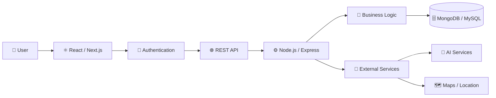

<div align="center">

# RAVEENDRAN JATHUGULAN

### Full Stack Developer · Software Engineering · MERN Stack

Building practical, scalable and user-focused web applications.

<p>
  <a href="https://github.com/Jathugulan">
    
  </a>
  <a href="https://www.linkedin.com/in/raveendran-jathugulan/">
    
  </a>
  <a href="mailto:jathugulan2022@gmail.com">
    
  </a>
</p>

<p>
  
  
  
</p>

</div>

---

## 👨‍💻 About Me

I'm **Raveendran Jathugulan**, a Full Stack Developer and **BICT (Hons.) undergraduate at the University of Vavuniya**.

I enjoy turning ideas into functional software by working across the **frontend, backend, database and API layers**. My current focus is building modern web applications with clean architecture, secure authentication and practical user experiences.

### What I Focus On

* ⚛️ Modern frontend development
* ⚙️ Backend & REST API engineering
* 🗄️ Database design and data management
* 🔐 Authentication, authorization & RBAC
* 🏗️ Software architecture and system design
* 🧪 Testing and application reliability
* 🤖 AI-integrated applications
* 🚀 Continuous learning and engineering best practices

---

## 🧭 Developer Snapshot

| Area               | Focus                             |
| ------------------ | --------------------------------- |
| **Role**           | Full Stack Developer              |
| **Primary Stack**  | MERN                              |
| **Frontend**       | React.js · Next.js · Tailwind CSS |
| **Backend**        | Node.js · Express.js              |
| **Databases**      | MongoDB · MySQL · SQL Server      |
| **Authentication** | JWT · OAuth · RBAC                |
| **APIs**           | RESTful APIs                      |
| **Tools**          | Git · GitHub · VS Code · Postman  |
| **Engineering**    | Architecture · Testing · Security |
| **Location**       | Sri Lanka                         |

---

# 🧰 Technology Stack

<div align="center">

### Frontend


### Backend


### Databases


### Programming Languages


### Tools & Development


</div>

---

# 🔐 Engineering Capabilities

<table>
<tr>
<td width="25%" align="center">

### ⚛️ Frontend

React.js
Next.js
Tailwind CSS
Bootstrap
Redux
Responsive UI

</td>

<td width="25%" align="center">

### ⚙️ Backend

Node.js
Express.js
PHP
Laravel
REST APIs
Business Logic

</td>

<td width="25%" align="center">

### 🗄️ Data

MongoDB
MongoDB Atlas
MySQL
SQL Server
Mongoose
Data Modeling

</td>

<td width="25%" align="center">

### 🔒 Security

JWT
OAuth
RBAC
bcrypt
Validation
Secure APIs

</td>
</tr>
</table>

---

# 🚀 Featured Projects

## 🩸 LifeLink — Emergency Blood Matching Platform

A full-stack emergency blood request and donor matching platform designed to help connect patients, hospitals and eligible donors.

**Key Engineering Areas**

* Emergency blood request management
* Donor matching
* Role-based access control
* Real-time notifications
* Location-based services
* Hospital and blood-bank workflows
* Secure authentication
* Analytics and dashboards

**Stack:** React · Node.js · Express.js · MongoDB · JWT · Socket.IO · Leaflet

---

## 🚗 QuickRide — Vehicle Rental & Booking System

A multi-role vehicle rental platform with customer, driver and administrator workflows.

**Key Engineering Areas**

* Vehicle marketplace
* Booking management
* Availability management
* Driver workflows
* Authentication & authorization
* Real-time communication
* Media management
* Administrative dashboards

**Stack:** React · Node.js · Express.js · MongoDB · Socket.IO · JWT

---

## 📚 Tholan Book Shop

A modern bookstore application designed around product discovery, shopping workflows and management functionality.

**Key Engineering Areas**

* Product management
* Shopping workflows
* User authentication
* Order management
* Admin operations
* Database-driven architecture

**Stack:** React · Node.js · Express.js · MongoDB

---

## 👨‍🏫 TeacherPayRoll ERP

An education-focused management system designed to centralize teacher and payroll-related operations.

**Key Engineering Areas**

* Employee management
* Attendance
* Leave management
* Payroll workflows
* Authentication
* Administrative operations
* Database management

---

## 🍽️ Vadamārutham Restaurant

A restaurant management and ordering platform developed using a traditional full-stack web architecture.

**Stack:** HTML · CSS · JavaScript · Bootstrap · PHP · MySQL

---

## 🎓 Alumni Management System

A university alumni management platform focused on centralized alumni records and communication.

**Stack:** PHP · MySQL · Bootstrap · JavaScript

---

# 🏗️ Full-Stack Architecture



---

# 🔄 Engineering Workflow

```text
Idea
  ↓
Requirements
  ↓
System Design
  ↓
UI / UX
  ↓
Frontend
  ↓
REST API
  ↓
Business Logic
  ↓
Database
  ↓
Authentication & Security
  ↓
Testing
  ↓
Documentation
  ↓
Deployment
```

---

# 📊 GitHub Analytics

<div align="center">


</div>

---

# 📈 Contribution Activity

<div align="center">


</div>

---

# 🎯 Current Learning Roadmap

<table>
<tr>
<td width="33%" valign="top">

### 01 · Full Stack

* Advanced React
* TypeScript
* Node.js
* Express
* REST APIs
* MongoDB

</td>

<td width="33%" valign="top">

### 02 · Engineering

* System Design
* Clean Architecture
* API Security
* Testing
* Performance
* Scalability

</td>

<td width="33%" valign="top">

### 03 · Modern Development

* Docker
* CI/CD
* Cloud Technologies
* AI Integration
* Observability
* DevOps Practices

</td>
</tr>
</table>

---

# 📜 Certifications & Training

* **3-Month MasterClass in Full Stack Development** — Pantech.AI
* **Introduction to MERN Stack** — Simplilearn
* **30-Days MasterClass in Data Analytics**
* **One-Month Internship in Data Analytics**
* **AI Internship**
* **Machine Learning Internship**
* **UI/UX Design Training**

---

# 💡 Engineering Principles

```text
Clean Code        →  Write for humans first
Security          →  Protect data and access
Scalability       →  Design beyond the first version
Performance       →  Measure before optimizing
Testing           →  Build confidence into every change
Documentation     →  Make systems understandable
User Experience   →  Technology should solve real problems
Continuous Growth →  Always keep learning
```

---

# 🤝 Let's Connect

I'm interested in opportunities involving:

**Full Stack Development · Software Engineering · Web Development · Backend Engineering · AI-Powered Applications**

<div align="center">

<a href="https://github.com/Jathugulan">

</a>

<a href="https://www.linkedin.com/in/raveendran-jathugulan/">

</a>

<a href="mailto:jathugulan2022@gmail.com">

</a>

</div>

---

<div align="center">

### Building today. Learning continuously. Engineering for tomorrow.


</div>
