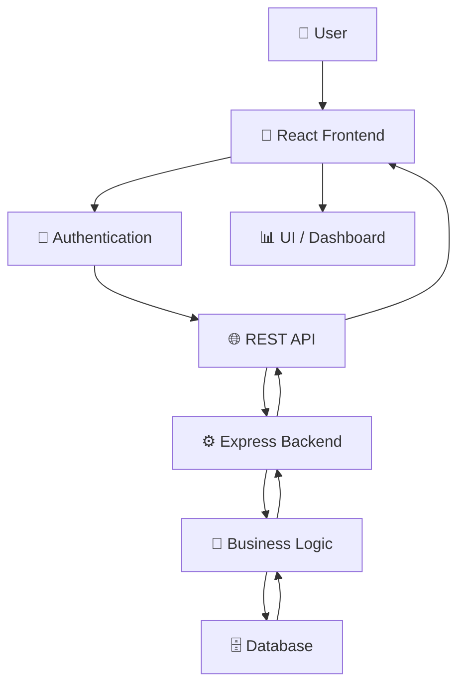
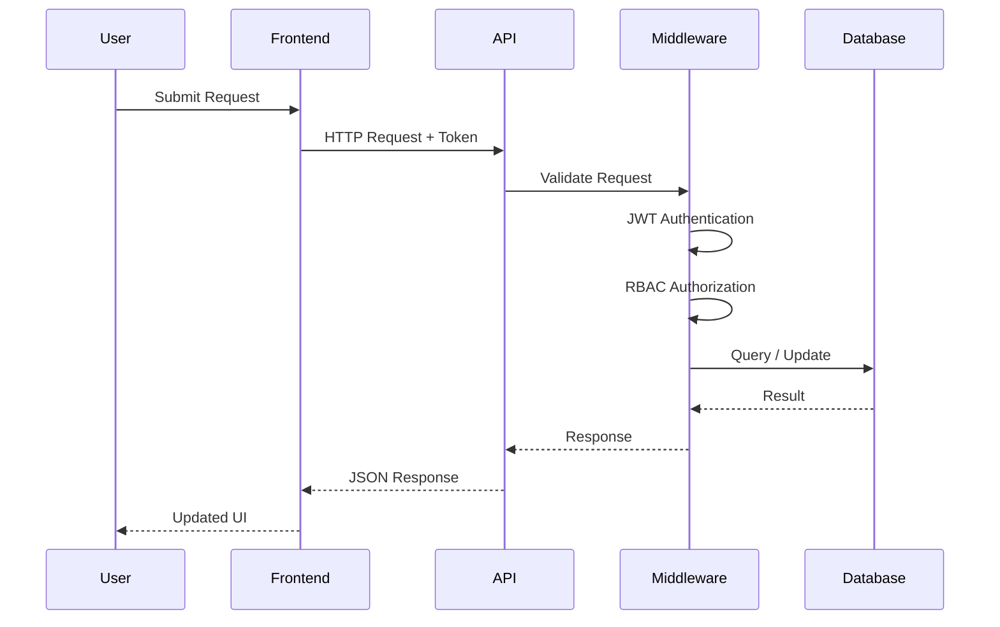
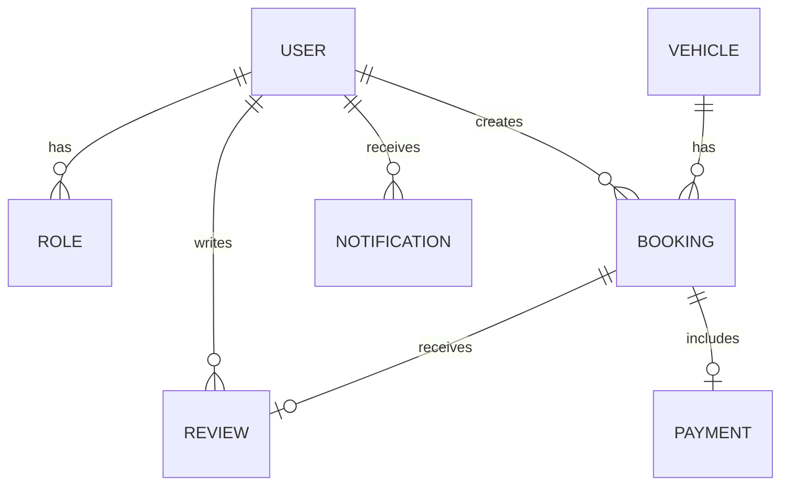
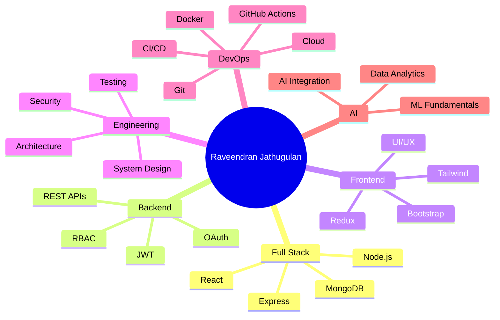
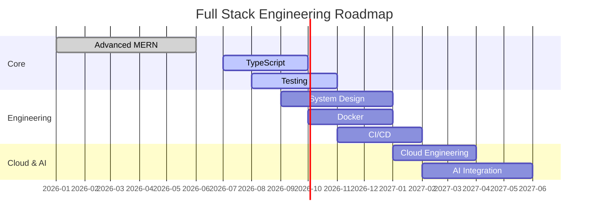
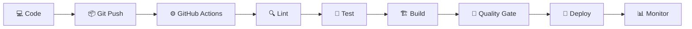

<div align="center">

<!-- ========================================================= -->
<!-- HERO / PREMIUM HEADER -->
<!-- ========================================================= -->


<br/>

<a href="https://github.com/Jathugulan">

</a>
<a href="https://www.linkedin.com/in/raveendran-jathugulan/">

</a>
<a href="https://portfolio-pi-sepia-30.vercel.app/">

</a>
<a href="mailto:jathugulan2022@gmail.com">

</a>

<br/><br/>

<a href="https://github.com/Jathugulan/Portfolio">

</a>
<a href="https://portfolio-pi-sepia-30.vercel.app/">

</a>

<br/><br/>


</div>

---

# 💫 About Me

I am **Raveendran Jathugulan**, a passionate **Full Stack Developer** from Sri Lanka and a Bachelor of Information and Communication Technology (Hons) undergraduate at the **University of Vavuniya**.

I build modern web applications with a strong interest in **MERN development, REST APIs, secure authentication, scalable architecture, UI/UX, cloud engineering, DevOps and AI-integrated applications**.

- 💻 Full Stack Web Development
- ⚛️ MERN Stack Application Development
- 🔐 JWT Authentication, OAuth & RBAC
- 🏗️ REST API & Backend Architecture
- 🎨 Responsive UI/UX
- 🗄️ MongoDB, MySQL & SQL Server
- 🐳 Docker & CI/CD
- ☁️ Cloud & deployment concepts
- 🤖 AI-integrated applications
- 📊 Data Analytics
- 🚀 Open to internships, collaboration and software opportunities

### 🧠 Development Philosophy

> **Build → Learn → Improve → Ship → Repeat**

---

# 🎓 Education

### Bachelor of Information and Communication Technology (Hons)

**University of Vavuniya**  
Faculty of Technological Studies · Sri Lanka  
**2023 – Present**

### Core Areas

`Software Engineering` · `Web Development` · `Database Systems` · `OOP` · `Data Structures` · `Computer Networks` · `HCI` · `System Analysis`

---

# 🛠️ Technical Skills

## 💻 Programming Languages

<p align="center">

</p>

`JavaScript` · `TypeScript` · `Java` · `Python` · `C++` · `C#` · `PHP` · `SQL`

## 🎨 Frontend

<p align="center">

</p>

`HTML5` · `CSS3` · `JavaScript` · `TypeScript` · `React.js` · `Next.js` · `Bootstrap` · `Tailwind CSS` · `Redux Toolkit` · `Context API`

## ⚙️ Backend

<p align="center">

</p>

`Node.js` · `Express.js` · `PHP` · `Laravel` · `Django` · `.NET` · `REST APIs`

## 🗄️ Databases

<p align="center">

</p>

`MongoDB` · `MongoDB Atlas` · `MySQL` · `SQL Server`

## 🔐 Security

`JWT` · `bcrypt` · `OAuth` · `RBAC` · `CORS` · `Input Validation` · `Protected Routes`

## 🧰 Tools & DevOps

<p align="center">

</p>

`Git` · `GitHub` · `VS Code` · `Postman` · `Figma` · `Docker` · `GitHub Actions` · `Vercel`

---

# 🌟 Featured Projects

## 🩸 LifeLink — Blood Donation Emergency Matcher

Emergency blood-request and donor matching platform.

**Highlights**

- 🩸 Blood-group compatibility matching
- 🚨 Emergency requests
- 📍 Location-based donor discovery
- 🔔 Real-time notifications
- 🏥 Hospital management
- 👤 Donor profiles
- 📊 Analytics dashboards
- 🗺️ Interactive maps
- 🔐 JWT authentication
- 🛡️ RBAC
- ⚡ Socket.IO real-time communication

**Stack:** `React` · `Node.js` · `Express` · `MongoDB` · `TypeScript` · `Socket.IO` · `JWT` · `Leaflet`

🔗 https://github.com/Jathugulan/blood-donation-emergency-matcher

---

## 📚 Tholan Book Shop

Modern MERN bookstore and e-commerce application.

- 📚 Book discovery
- 🔎 Search and filtering
- 🛒 Online ordering
- 📦 Inventory management
- 👥 Customer management
- 🤖 AI recommendation concepts
- 📍 Location-based delivery
- 📊 Admin analytics
- 🔐 Secure authentication

**Stack:** `React` · `Redux Toolkit` · `Node.js` · `Express.js` · `MongoDB` · `Tailwind CSS`

🔗 https://github.com/Jathugulan/tholan-book-shop

---

## 🚗 QuickRide — Vehicle Rental & Booking

Full-stack vehicle rental and booking management platform.

- 🚘 Vehicle discovery
- 📅 Availability management
- 🔎 Search and filtering
- 🛒 Rental booking
- 🔐 Authentication
- 🛡️ RBAC
- 🚫 Double-booking prevention
- 📊 Booking management

**Stack:** `React` · `Node.js` · `Express.js` · `MongoDB` · `Mongoose` · `JWT`

🔗 https://github.com/Jathugulan/quickride-vehicle-rental-booking

---

## 👨‍🏫 TeacherPayRoll ERP

Teacher attendance, leave and payroll management system.

**Stack:** `MERN` · `JWT` · `Google OAuth`

🔗 https://github.com/Jathugulan/TeacherPayRollERP

---

## 🍽️ Vada Marutham Restaurant

Restaurant management and ordering application.

**Stack:** `HTML5` · `CSS3` · `JavaScript` · `Bootstrap` · `PHP` · `MySQL`

🔗 https://github.com/Jathugulan/vadamarutham-restaurant

---

## 🎓 Alumni Management System

University alumni management and communication platform.

**Stack:** `PHP` · `MySQL` · `Bootstrap` · `JavaScript`

🔗 https://github.com/Jathugulan/Alumni-Management-system

---

## 💊 PharmaNova

Desktop pharmacy management system.

**Stack:** `C#` · `.NET Framework` · `Windows Forms` · `SQL Server`

🔗 https://github.com/Jathugulan/PharmaNova

---

# 🧩 Project Engineering Matrix

| Project | Domain | Architecture | Main Engineering |
|---|---|---|---|
| 🩸 LifeLink | Healthcare | MERN | Real-Time + Geo |
| 📚 Tholan Book Shop | E-Commerce | MERN | AI + Maps |
| 🚗 QuickRide | Vehicle Rental | MERN | Booking + RBAC |
| 👨‍🏫 TeacherPayRoll | ERP | Full Stack | Payroll + OAuth |
| 🍽️ Vada Marutham | Restaurant | Full Stack | Ordering + Reservation |
| 🎓 Alumni System | Education | PHP/MySQL | CRUD + Management |
| 💊 PharmaNova | Pharmacy | .NET | Desktop ERP |

---

# 💼 Experience

## Full Stack Web Development Intern — Pantech.AI

**3-Month Internship · 2026**

- Full-stack web development
- Frontend and backend integration
- REST API development
- Database-driven applications
- Practical software engineering workflows

## Full Stack Development Internship — NoviTech R&D

**1-Month Internship / MasterClass · 2026**

- Full-stack application development
- Frontend/backend integration
- Modern web development practices
- Software development workflows

---

# 🏅 Achievements & Certifications

- 🏆 Full Stack Web Development Internship — **Pantech.AI**
- 🚀 30 Days MasterClass in Full Stack Development — **NoviTech R&D**
- 🌐 Introduction to MERN Stack — **Simplilearn**
- 🌐 Introduction to MEAN Stack — **Simplilearn**
- 🎨 Web Design for Beginners — **University of Moratuwa**
- ⚙️ Professional Certificate in DevOps — **Udemy**
- 🤖 Artificial Intelligence — **Pantech.AI**
- 🧠 Machine Learning — **Pantech.AI**
- 💡 I2OR Young Innovator Mindset — **I2OR**
- 💻 Introduction to JavaScript — **Sololearn**
- 🗄️ Introduction to SQL — **Sololearn**
- 🐍 Introduction to Python — **Saylor Academy**
- ☕ Java (Basic) — **HackerRank**

---

# 📊 GitHub Analytics

<div align="center">


</div>

---

# 🔥 GitHub Streak

<div align="center">


</div>

---

# 🏆 GitHub Trophies

<div align="center">


</div>

---

# 📈 Contribution Heatmap & Activity Graph

<div align="center">


</div>

---

# 🐍 Contribution Snake

<div align="center">


</div>

> ⚙️ Generate the snake SVG using a GitHub Actions workflow in the profile repository.

---

# 📊 Productivity & Development Metrics

The following dynamic integrations are supported by this profile architecture:

| Metric | Integration | Status |
|---|---|---|
| GitHub Stats | GitHub Readme Stats | ✅ Active |
| Top Languages | GitHub Readme Stats | ✅ Active |
| Streak | GitHub Streak | ✅ Active |
| Activity Graph | Activity Graph | ✅ Active |
| Trophies | Profile Trophy | ✅ Active |
| Visitors | Profile Views | ✅ Active |
| Followers | Shields | ✅ Active |
| Stars | Shields | ✅ Active |
| WakaTime | WakaTime | 🔧 Optional Setup |
| LeetCode | LeetCode Stats | 🔧 Optional Setup |
| HackerRank | Badge/Profile | 🔧 Optional Setup |
| Codeforces | Rating Card | 🔧 Optional Setup |
| CodeChef | Rating Card | 🔧 Optional Setup |
| Holopin | Badge Board | 🔧 Optional Setup |
| Spotify | Now Playing | 🔧 Optional Setup |
| Blog Posts | GitHub Action | 🔧 Optional Setup |
| YouTube | GitHub Action | 🔧 Optional Setup |

---

# 📉 Charts & Developer Metrics

## 📊 Skill Distribution

```text
Frontend Engineering     ████████████████████  Advanced
Backend Engineering      ███████████████████░  Strong
Database Engineering     ██████████████████░░  Strong
API Engineering          ██████████████████░░  Strong
Authentication / RBAC    █████████████████░░░  Strong
UI / UX                  ████████████████░░░░  Strong
Testing                  █████████████░░░░░░░  Growing
DevOps                   ████████████░░░░░░░░  Growing
Cloud                    ███████████░░░░░░░░░  Growing
AI Integration           ██████████░░░░░░░░░░  Growing
System Design            ██████████░░░░░░░░░░  Growing
```

## 📈 Development Progress

```text
MERN Development       ████████████████████
REST API Engineering   ███████████████████░
TypeScript             ████████████████░░░░
Security / RBAC        ████████████████░░░░
Testing                █████████████░░░░░░░
Docker                 ████████████░░░░░░░░
CI/CD                  ███████████░░░░░░░░░
Cloud                  ██████████░░░░░░░░░░
System Design          ██████████░░░░░░░░░░
AI Integration         ██████████░░░░░░░░░░
```

> These are personal development indicators, not formal assessment scores.

---

# 🧠 Architecture Diagrams

## 🔄 Full Stack Application Workflow



## 🔐 Secure API Request Flow



## 🗄️ Database Architecture Concept



> Diagram relationships are an architectural representation for profile documentation, not a complete database schema for every project.

---

# 🧠 Project Mind Map



---

# 🗓️ Development Roadmap



---

# 💻 Coding Developer Stats

## ⏱️ WakaTime

```text
WakaTime integration:
Add your WakaTime username and generated badge/card here.
```

> 🔧 Optional: connect WakaTime through your profile README or an automated GitHub workflow.

## 🧩 LeetCode

```text
LeetCode integration:
Add your LeetCode username/card here when available.
```

## 🏅 HackerRank

```text
HackerRank integration:
Add your HackerRank profile/badge here when available.
```

## 🏆 Codeforces / CodeChef

```text
Competitive programming integration:
Add rating cards after providing your Codeforces / CodeChef usernames.
```

## 🎨 Holopin

```text
Holopin badge board:
Add your Holopin board after connecting your Holopin username.
```

> Usernames for these services were not provided, so no fake scores, ratings or identities are displayed.

---

# 📌 Repository Pin Cards

<div align="center">

<a href="https://github.com/Jathugulan/blood-donation-emergency-matcher">

</a>

<a href="https://github.com/Jathugulan/tholan-book-shop">

</a>

<a href="https://github.com/Jathugulan/quickride-vehicle-rental-booking">

</a>

<a href="https://github.com/Jathugulan/TeacherPayRollERP">

</a>

</div>

---

# 🥇 Top Contributed Repositories

<div align="center">

<!-- Optional dynamic service: replace with a configured contribution-stat provider if desired. -->

| Repository | Focus |
|---|---|
| 🩸 LifeLink | Healthcare / Real-Time MERN |
| 📚 Tholan Book Shop | E-Commerce / MERN |
| 🚗 QuickRide | Rental / Booking / MERN |
| 👨‍🏫 TeacherPayRollERP | ERP / Authentication |
| 🎓 Alumni Management | PHP / MySQL |
| 💊 PharmaNova | C# / .NET / SQL |

</div>

---

# 📰 Latest Blog Posts — Automation Ready

```text
┌───────────────────────────────────────────┐
│          LATEST BLOG POSTS                 │
├───────────────────────────────────────────┤
│ 📝 Post 01 → Auto-updated by GitHub Action │
│ 📝 Post 02 → Auto-updated by GitHub Action │
│ 📝 Post 03 → Auto-updated by GitHub Action │
└───────────────────────────────────────────┘
```

**Recommended workflow:** RSS / blog feed → GitHub Action → generated Markdown → README section.

---

# 🎥 Latest YouTube Videos — Automation Ready

```text
┌───────────────────────────────────────────┐
│          LATEST VIDEOS                    │
├───────────────────────────────────────────┤
│ 🎬 Video 01 → Auto-updated                │
│ 🎬 Video 02 → Auto-updated                │
│ 🎬 Video 03 → Auto-updated                │
└───────────────────────────────────────────┘
```

**Recommended workflow:** YouTube RSS → GitHub Action → README update.

---

# 🎵 Spotify Now Playing — Optional

<div align="center">

```text
🎵 Spotify Now Playing
Connect a Spotify integration to display the current track.
```

</div>

> No Spotify username/account information was supplied, so this is intentionally left as an integration-ready feature.

---

# 💬 Quote of the Day

<div align="center">

> **"Great software is built one improvement at a time."**

</div>

### 🔄 Dynamic Quote Integration

Optional automation can replace the static quote with:

```text
Quote API
   ↓
GitHub Action
   ↓
README Generator
   ↓
Profile README
```

---

# 🌍 Current Time / Location

<div align="center">

📍 **Point Pedro, Jaffna, Sri Lanka**  
🌐 **Sri Lanka Standard Time — UTC+05:30**

</div>

> A real-time clock widget requires a client-side or external dynamic service. GitHub README Markdown itself does not execute JavaScript.

---

# 📬 Contact & Social

<div align="center">

<a href="https://www.linkedin.com/in/raveendran-jathugulan/">

</a>

<a href="https://portfolio-pi-sepia-30.vercel.app/">

</a>

<a href="https://github.com/Jathugulan/Portfolio">

</a>

<a href="mailto:jathugulan2022@gmail.com">

</a>

</div>

### 📄 Resume

<a href="https://portfolio-pi-sepia-30.vercel.app/">

</a>

> The portfolio contains the current resume and professional profile.

### ☕ Support

```text
Optional:
Buy Me a Coffee / GitHub Sponsors / Ko-fi
```

> Add a support link only when you have an active account.

---

# 🌱 Currently Learning

<div align="center">


</div>

---

# 🎯 Strategic Targets & Development Goals

## 2026 → 2027

- [x] Build full-stack applications
- [x] Build REST APIs
- [x] Work with MongoDB
- [x] Work with MySQL
- [x] Implement JWT authentication
- [x] Implement RBAC
- [x] Complete full-stack internships
- [ ] Master TypeScript
- [ ] Improve system design
- [ ] Build production-grade SaaS applications
- [ ] Build CI/CD pipelines
- [ ] Improve cloud engineering
- [ ] Contribute to open source
- [ ] Build AI-integrated applications
- [ ] Design scalable distributed systems

---

# 🧪 Engineering Quality Standards

```text
┌───────────────────────────────────────────┐
│         SOFTWARE QUALITY CHECKLIST        │
├───────────────────────────────────────────┤
│ ✅ Clean Code                             │
│ ✅ Modular Architecture                   │
│ ✅ Reusable Components                    │
│ ✅ Secure Authentication                  │
│ ✅ RBAC Authorization                     │
│ ✅ Input Validation                       │
│ ✅ Centralized Error Handling             │
│ ✅ Responsive UI                          │
│ ✅ Database Validation                    │
│ ✅ API Documentation                      │
│ ✅ Unit Testing                           │
│ ✅ Integration Testing                    │
│ ✅ Git Version Control                    │
│ ✅ CI/CD                                  │
└───────────────────────────────────────────┘
```

---

# 🔐 Security Architecture

```text
Client
  │
  ▼
🛡️ Rate Limiting
  │
  ▼
🌐 CORS
  │
  ▼
✅ Input Validation
  │
  ▼
🔑 Authentication
  │
  ▼
👮 RBAC Authorization
  │
  ▼
⚙️ Business Logic
  │
  ▼
🗄️ Database
```

---

# ⚙️ CI/CD Pipeline



---

# 🤖 GitHub Profile Automation

This profile is designed to support automated dynamic sections.

### Recommended Automation

| Workflow | Purpose |
|---|---|
| 🐍 `snake.yml` | Contribution Snake |
| 📊 `stats.yml` | Repository statistics |
| 📝 `readme-update.yml` | Dynamic README sections |
| 📰 `blog.yml` | Latest blog posts |
| 🎥 `youtube.yml` | Latest videos |
| 🎵 `spotify.yml` | Now Playing |
| ⏱️ `wakatime.yml` | Coding statistics |
| 🏆 `metrics.yml` | GitHub Metrics |
| 🔍 `health.yml` | README link checks |
| 📦 `projects.yml` | Project portfolio updates |

---

# 📈 Weekly Development Breakdown

```text
WEEKLY ENGINEERING DASHBOARD

💻 Coding                 ████████████████████
📚 Learning               █████████████████░░░
🧪 Testing                ███████████████░░░░░
🏗️ Architecture           █████████████░░░░░░░
📖 Documentation          ███████████░░░░░░░░░
🌍 Open Source             █████████░░░░░░░░░░░
```

> This section is a visual framework. Connect WakaTime or another coding-data provider for real weekly measurements.

---

# 🏅 GitHub Achievements

<div align="center">


</div>

---

# 👀 Visitors & Profile Reach

<div align="center">


<br/><br/>


</div>

---

# 🌍 Open Source & Collaboration

I'm interested in collaborating on:

- 🚀 Full-stack applications
- 🌐 MERN projects
- 🤖 AI-integrated applications
- 📊 Data-driven platforms
- 🔗 REST API projects
- 🧰 Developer tools
- 🎓 University projects
- 🌍 Open-source projects
- 💡 Innovative technology solutions

---

# 🗣️ Languages

| Language | Proficiency |
|---|---|
| 🇱🇰 Tamil | Professional Working Proficiency |
| 🇬🇧 English | Working Proficiency |
| 🇱🇰 Sinhala | Working Proficiency |

---

# 📌 Profile Snapshot

<div align="center">

| 👨‍💻 Role | 🚀 Primary Stack | 🎓 Education | 📍 Location |
|---|---|---|---|
| Full Stack Developer | MERN | BICT (Hons.) | Jaffna, Sri Lanka |

</div>

---

# 🌐 Portfolio

<div align="center">

### 🚀 Explore My Complete Developer Portfolio

<a href="https://portfolio-pi-sepia-30.vercel.app/">

</a>

<br/><br/>

<a href="https://github.com/Jathugulan/Portfolio">

</a>

<br/><br/>

**Live Portfolio:**  
`https://portfolio-pi-sepia-30.vercel.app/`

**Source Repository:**  
`https://github.com/Jathugulan/Portfolio`

</div>

---

# 🧭 Recruiter Quick View

| Category | Highlights |
|---|---|
| 👨‍💻 Role | Full Stack Developer |
| ⚛️ Primary Stack | MERN |
| 🎨 Frontend | React · Next.js · Tailwind · Bootstrap |
| ⚙️ Backend | Node.js · Express · PHP |
| 🗄️ Database | MongoDB · MySQL · SQL Server |
| 🔐 Security | JWT · OAuth · RBAC |
| 🧪 Engineering | Testing · Validation · API Design |
| 🐳 DevOps | Docker · GitHub Actions · CI/CD |
| ☁️ Cloud | Cloud Engineering Concepts |
| 🤖 AI | AI Integration · ML Fundamentals |
| 🎓 Education | BICT (Hons.) |
| 🌍 Location | Jaffna, Sri Lanka |
| 📬 Contact | LinkedIn · GitHub · Portfolio · Email |

---

# 💭 Developer Quote

<div align="center">

> ### **"Build → Learn → Improve → Ship → Repeat."**

<br/>

**Every project is a chance to become a better engineer.**

</div>

---

# ⭐ 2026 Profile Feature Checklist

| # | Advanced Feature | Included |
|---:|---|:---:|
| 01 | Animated Hero Banner | ✅ |
| 02 | Typing Animation | ✅ |
| 03 | Glassmorphism-style Header | ✅ |
| 04 | Gradient Sections | ✅ |
| 05 | Custom Profile Area | ✅ |
| 06 | Theme-Friendly Design | ✅ |
| 07 | Wave Dividers | ✅ |
| 08 | Responsive Badges | ✅ |
| 09 | GitHub Readme Stats | ✅ |
| 10 | GitHub Streak | ✅ |
| 11 | Top Languages | ✅ |
| 12 | Contribution Heatmap | ✅ |
| 13 | Activity Graph | ✅ |
| 14 | Contribution Snake | ✅ |
| 15 | GitHub Trophy | ✅ |
| 16 | Repository Pin Cards | ✅ |
| 17 | Skill Bar Charts | ✅ |
| 18 | Language Metrics | ✅ |
| 19 | Development Progress | ✅ |
| 20 | Productivity Framework | ✅ |
| 21 | Commit / Activity Visualization | ✅ |
| 22 | Mermaid Flowchart | ✅ |
| 23 | Mermaid Mind Map | ✅ |
| 24 | Mermaid Sequence Diagram | ✅ |
| 25 | Mermaid Gantt | ✅ |
| 26 | Project Architecture | ✅ |
| 27 | System Workflow | ✅ |
| 28 | Database ER Diagram | ✅ |
| 29 | About Me | ✅ |
| 30 | Tech Stack Icons | ✅ |
| 31 | Featured Projects | ✅ |
| 32 | Experience Timeline | ✅ |
| 33 | Certifications | ✅ |
| 34 | Education | ✅ |
| 35 | Achievements | ✅ |
| 36 | WakaTime Integration Point | 🔧 |
| 37 | LeetCode Integration Point | 🔧 |
| 38 | HackerRank Integration Point | 🔧 |
| 39 | Codeforces / CodeChef Point | 🔧 |
| 40 | Holopin Integration Point | 🔧 |
| 41 | Visitor Counter | ✅ |
| 42 | Profile Views | ✅ |
| 43 | Followers & Stars | ✅ |
| 44 | Spotify Integration Point | 🔧 |
| 45 | Quote of the Day | ✅ |
| 46 | Dynamic Quote Workflow | 🔧 |
| 47 | Location / Time | ✅ |
| 48 | LinkedIn | ✅ |
| 49 | Portfolio | ✅ |
| 50 | Gmail | ✅ |
| 51 | Resume CTA | ✅ |
| 52 | Support Badge Point | 🔧 |
| 53 | 3D Contribution Integration Point | 🔧 |
| 54 | GitHub Metrics Dashboard Point | 🔧 |
| 55 | Blog Auto-Update Point | 🔧 |
| 56 | YouTube Auto-Update Point | 🔧 |
| 57 | Latest GitHub Activity | ✅ |
| 58 | Weekly Development Breakdown | 🔧 |

**Legend:**  
`✅ Included directly` · `🔧 Requires external account/API/GitHub Action setup`

---

# ⚠️ Dynamic Feature Setup Notes

GitHub profile README files are primarily Markdown. They **cannot execute arbitrary JavaScript directly**.

Therefore, features such as:

- Spotify Now Playing
- Real-time clock widgets
- WakaTime live data
- Dynamic blog feeds
- YouTube auto-updates
- 3D contribution visualizations
- Automated weekly statistics

need an external image/API service or a GitHub Actions workflow.

This README intentionally avoids inventing your usernames, ratings, coding hours or external accounts. Once those accounts are available, the integration points can be activated.

---

# 🧰 Recommended Profile Repository Automation

Create these files inside your `Jathugulan/Jathugulan` profile repository:

```text
Jathugulan/
│
├── README.md
│
└── .github/
    └── workflows/
        ├── snake.yml
        ├── metrics.yml
        ├── readme-update.yml
        ├── blog.yml
        ├── youtube.yml
        ├── wakatime.yml
        └── health.yml
```

### Automation Flow

```text
GitHub Activity
      ↓
GitHub Actions
      ↓
Data Collection
      ↓
README Generator
      ↓
README.md
      ↓
GitHub Profile
      ↓
Recruiters / Visitors
```

---

# 🚀 Final Developer Dashboard

<div align="center">

```text
╔══════════════════════════════════════════════════╗
║              RAVEENDRAN JATHUGULAN               ║
╠══════════════════════════════════════════════════╣
║ 💻 Full Stack Developer                          ║
║ ⚛️ MERN Stack                                    ║
║ 🔐 Secure APIs + RBAC                            ║
║ 🗄️ MongoDB + MySQL + SQL Server                  ║
║ 🐳 Docker + CI/CD                                ║
║ ☁️ Cloud Engineering                             ║
║ 🤖 AI Integration                                ║
║ 🧠 System Design                                 ║
║ 🚀 Building Real-World Applications              ║
╚══════════════════════════════════════════════════╝
```

### **Code. Build. Learn. Improve. Ship. 🚀**

</div>

---

<div align="center">

<a href="https://github.com/Jathugulan">

</a>
<a href="https://www.linkedin.com/in/raveendran-jathugulan/">

</a>
<a href="https://portfolio-pi-sepia-30.vercel.app/">

</a>
<a href="mailto:jathugulan2022@gmail.com">

</a>

<br/><br/>


<br/><br/>


### ⭐ Thanks for visiting my GitHub profile!

**Always learning · Always building · Always improving · Always shipping 🚀**

</div>
